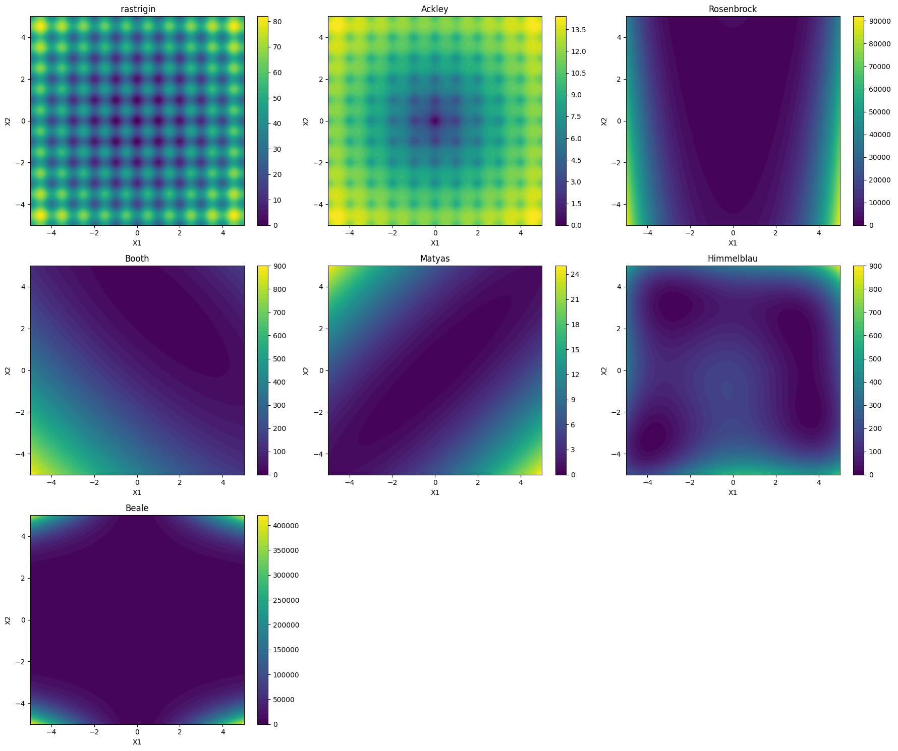
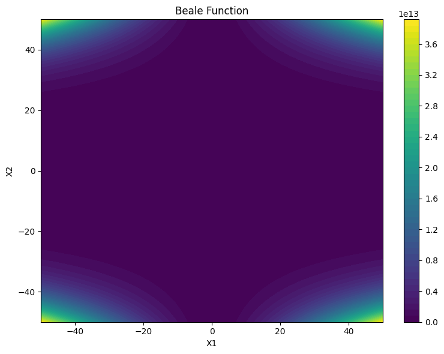
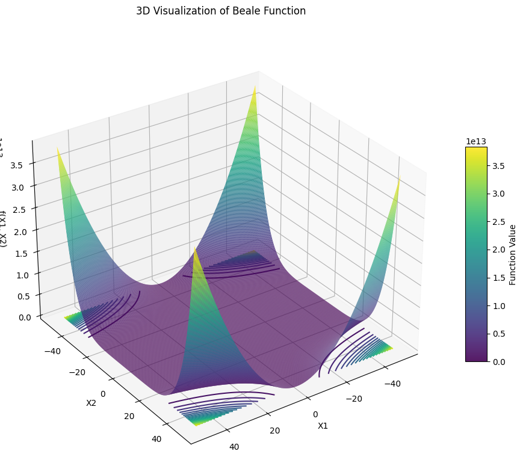
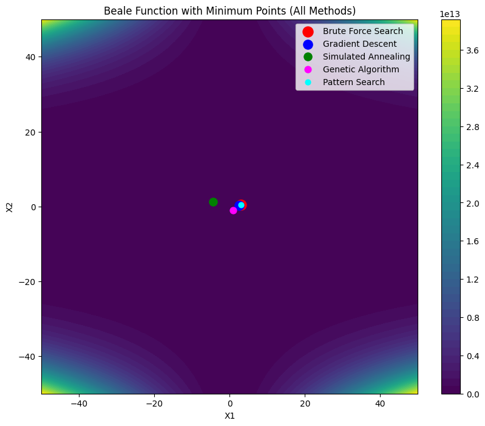
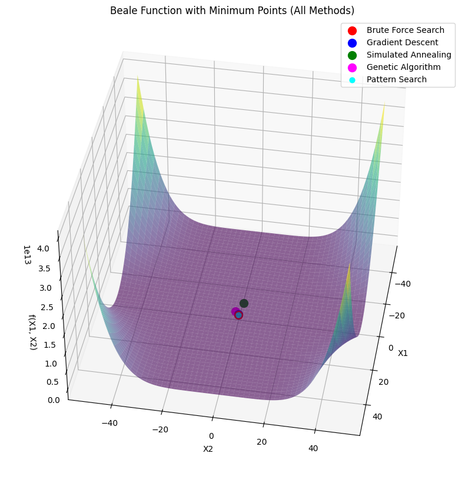

<div align="center">

# 🔬 Beale Function — Five Optimization Methods
### MSc Robotics and Artificial Intelligence — ITMO University

[](https://www.python.org/)
[](https://numpy.org/)
[](https://matplotlib.org/)
[](https://www.sympy.org/)
[](https://jupyter.org/)
[](https://github.com/umerahmedbaig7)
[]()

<br>

> *"Finding the minimum of a function that hides its global optimum behind steep ridges and deceptive local basins is not merely a mathematical exercise — it is the essential capability that allows autonomous systems to calibrate sensors, plan trajectories, and tune controllers in the face of non-convex, multimodal real-world cost landscapes."*

<br>

**Author:** Umer Ahmed Baig Mughal <br>
**Programme:** MSc Robotics and Artificial Intelligence <br>
**Specialization:** Machine Learning · Computer Vision · Human-Robot Interaction · Autonomous Systems · Robotic Motion Control <br>
**Institution:** ITMO University — Faculty of Control Systems and Robotics

</div>

---

## 📋 Table of Contents

1. [🎯 Objective](#-objective)
2. [📐 Theoretical Background](#-theoretical-background)
   - [The Beale Benchmark Function](#the-beale-benchmark-function)
   - [Benchmark Function Landscape and Global Minimum](#benchmark-function-landscape-and-global-minimum)
   - [Brute Force Search](#brute-force-search)
   - [Gradient Descent with Analytical Gradient](#gradient-descent-with-analytical-gradient)
   - [Simulated Annealing](#simulated-annealing)
   - [Genetic Algorithm](#genetic-algorithm)
   - [Pattern Search — Hooke-Jeeves Method](#pattern-search--hooke-jeeves-method)
   - [System Properties](#system-properties)
3. [📊 Benchmark Function Reference](#-benchmark-function-reference)
4. [⚙️ Algorithm Parameters](#️-algorithm-parameters)
   - [Brute Force Parameters](#brute-force-parameters)
   - [Gradient Descent Parameters](#gradient-descent-parameters)
   - [Simulated Annealing Parameters](#simulated-annealing-parameters)
   - [Genetic Algorithm Parameters](#genetic-algorithm-parameters)
   - [Pattern Search Parameters](#pattern-search-parameters)
5. [🛠️ Implementation](#️-implementation)
   - [File Structure](#file-structure)
   - [Function Reference](#function-reference)
   - [Algorithm Walkthrough](#algorithm-walkthrough)
6. [🚀 How to Run](#-how-to-run)
7. [📈 Results](#-results)
8. [🔍 Analysis and Conclusions](#-analysis-and-conclusions)
9. [🧰 Dependencies](#-dependencies)
10. [📝 Notes and Limitations](#-notes-and-limitations)
11. [👤 Author](#-author)
12. [📄 License](#-license)

---

## 🎯 Objective

This lab applies **five distinct optimization algorithms** to minimize the Beale function — a well-known two-dimensional, multimodal benchmark function with a single global minimum and a challenging non-convex landscape — comparing their ability to locate the exact global minimum `f(3, 0.5) = 0` across different algorithmic paradigms, from exhaustive deterministic search to stochastic population-based methods.

The underlying benchmark function is:

```
f(x1, x2) = (1.5 − x1 + x1·x2)²
           + (2.25 − x1 + x1·x2²)²
           + (2.625 − x1 + x1·x2³)²

Global minimum:  f(3, 0.5) = 0
Search domain:   x1, x2 ∈ [−10, 10]
```

The key learning outcomes are:

- Understanding the **trade-off between exhaustiveness and computational cost** in Brute Force Search — how a uniform grid with step size `h = 0.1` over `[−10, 10]²` evaluates 40,401 candidate points to guarantee finding the global minimum, and why this approach becomes intractable as problem dimensionality grows.
- Deriving and implementing the **analytical gradient** of the Beale function by hand — computing `∂f/∂x1` and `∂f/∂x2` using the chain rule across all three squared terms — and understanding why Gradient Descent converges to a local minimum when initialized at `x₀ = [1, 1]`, reflecting the algorithm's fundamental sensitivity to both starting point and learning rate.
- Implementing **Simulated Annealing** with geometric cooling schedule `T_k = α · T_{k−1}` and Gaussian neighbourhood perturbation, understanding the Metropolis acceptance criterion `P(accept) = exp(−ΔE / T)` — and recognising how the cooling rate `α = 0.95` and initial temperature `T₀ = 1000` jointly control the balance between exploration and exploitation across 1000 iterations.
- Building a **Genetic Algorithm** from scratch using fitness-proportionate (roulette wheel) selection, single-point crossover, and uniform mutation — implementing all three evolutionary operators explicitly in NumPy without any external evolutionary computation library — and analysing why the standard GA configuration with `pop_size = 50` and `num_generations = 200` fails to reach the global minimum due to premature convergence.
- Implementing the **Hooke-Jeeves Pattern Search** algorithm with its two-phase exploratory-then-pattern-move structure — alternating between a coordinate-axis exploratory search and a momentum-based pattern move in the direction of improvement — and observing how adaptive step reduction to `min_step = 10⁻⁶` allows the method to converge exactly to `f(3, 0.5) = 0`.
- **Visualizing all five optimum candidates simultaneously** on both the 2D contour and 3D surface of the Beale function over the domain `[−50, 50]²`, providing direct geometric intuition for why certain methods converge near the global minimum while others are trapped in local basins or flat regions of the landscape.

The lab is implemented as a single Jupyter notebook (`Beale_Function_Optimization.ipynb`) running on Python 3.9 with NumPy as the sole algorithmic dependency, producing a 3×3 benchmark function grid, a 2D contour, a 3D surface of the Beale function, and two overlay figures showing all five optimum candidates on both the 2D contour and 3D surface.

---

## 📐 Theoretical Background

### The Beale Benchmark Function

The Beale function is a standard **multimodal, non-convex** benchmark used to evaluate the performance of optimization algorithms. It is defined over `ℝ²` as:

```
f(x1, x2) = (A − x1 + x1·x2)²
           + (B − x1 + x1·x2²)²
           + (C − x1 + x1·x2³)²

where:
    A = 1.5,   B = 2.25,   C = 2.625
    Standard domain:      x1, x2 ∈ [−4.5, 4.5]
    Visualization domain: x1, x2 ∈ [−50, 50]
```

The function is the sum of three squared terms, each structured as `(constant − x1 + x1·x2ᵏ)²` for `k = 1, 2, 3`. This structure creates a narrow curved valley that winds through the search space, making gradient-based methods particularly prone to overshooting or stalling unless carefully initialized and tuned.

### Benchmark Function Landscape and Global Minimum

```
Global minimum:  f(3, 0.5) = 0
Location:        x1* = 3,  x2* = 0.5  (unique global minimum)
Function type:   Non-convex, multimodal with steep ridges near the domain boundary
Landscape:       Deep narrow valley curving toward (3, 0.5);
                 function values grow rapidly away from the valley floor
```

The Beale function achieves `f(3, 0.5) = 0` because each of the three squared terms evaluates to zero simultaneously:

```
Term 1:  (1.5 − 3 + 3·0.5)²     = (1.5 − 3 + 1.5)²     = 0²  = 0
Term 2:  (2.25 − 3 + 3·0.25)²   = (2.25 − 3 + 0.75)²   = 0²  = 0
Term 3:  (2.625 − 3 + 3·0.125)² = (2.625 − 3 + 0.375)² = 0²  = 0
```

### Brute Force Search

Brute Force Search discretizes the search domain into a uniform grid and evaluates the objective function at every grid point, tracking the best value found:

```
Grid:    x1 ∈ arange(bounds[0][0], bounds[0][1] + step, step)
         x2 ∈ arange(bounds[1][0], bounds[1][1] + step, step)

For each (x1, x2) in grid:
    if f(x1, x2) < best_f:
        best_x = [x1, x2]
        best_f = f(x1, x2)
```

With `bounds = [−10, 10]` and `h = 0.1`, the grid contains `201 × 201 = 40,401` points. This **guarantees finding the global minimum** within the grid resolution but at `O(1/h²)` cost — impractical for high dimensions or fine resolutions.

### Gradient Descent with Analytical Gradient

Gradient Descent iteratively moves the current estimate in the direction of steepest function descent:

```
x_{k+1} = x_k − α · ∇f(x_k)

where:
    α    — learning rate (step size)
    ∇f   — gradient vector [∂f/∂x1, ∂f/∂x2]ᵀ
```

The **analytical gradient** of the Beale function is derived by differentiating all three terms via the chain rule:

```
∂f/∂x1 = 2(A − x1 + x1·x2)(−1 + x2)
        + 2(B − x1 + x1·x2²)(−1 + x2²)
        + 2(C − x1 + x1·x2³)(−1 + x2³)

∂f/∂x2 = 2(A − x1 + x1·x2)(x1)
        + 2(B − x1 + x1·x2²)(2·x1·x2)
        + 2(C − x1 + x1·x2³)(3·x1·x2²)
```

The stopping criterion is `‖∇f(x_k)‖ < tol` (gradient norm below tolerance) or reaching `max_iter`. The algorithm is guaranteed to converge to a **stationary point** but not necessarily the global minimum — it finds the nearest local basin from the initialization point.

### Simulated Annealing

Simulated Annealing (SA) is a stochastic global optimization method inspired by the physical annealing process in metallurgy. At temperature `T`, a candidate neighbour state is accepted even if worse than the current state, with probability:

```
P(accept worse move) = exp(−ΔE / T)

where:
    ΔE = f(neighbour) − f(current)   > 0  (worse move)
    T  — current temperature
```

The temperature follows a **geometric (exponential) cooling** schedule:

```
T_{k+1} = α · T_k       (α < 1, cooling rate)
```

The neighbourhood is generated by adding zero-mean Gaussian noise, clipped to the search bounds:

```
neighbour = current_state + N(0, σ²)     clipped to [bounds_min, bounds_max]
```

### Genetic Algorithm

The Genetic Algorithm (GA) maintains a **population** of candidate solutions and evolves them across generations using three biologically inspired operators:

**1. Selection — Fitness-proportionate (roulette wheel):**

```
fitness_i = −f(xᵢ) + |min(−f)| + ε      (shift to all-positive)
P(select i) = fitness_i / Σⱼ fitness_j
```

**2. Crossover — Single-point:**

```
crossover_point ∈ {0, 1}  (random binary per individual)
offspring[i] = parent[i]          if crossover_point = 1
offspring[i] = parent[(i+1) % N]  if crossover_point = 0
```

**3. Mutation — Uniform random replacement:**

```
For each gene:
    if rand() < mutation_rate:
        gene ← Uniform(bounds_min, bounds_max)
```

The population is entirely replaced by offspring at each generation. The best individual from the final generation is returned as the solution.

### Pattern Search — Hooke-Jeeves Method

The Hooke-Jeeves method alternates between two movement phases:

**Phase 1 — Exploratory move (coordinate-axis search):**

```
For each dimension i ∈ {0, 1}:
    For direction ∈ {−1, +1}:
        x_candidate = x;  x_candidate[i] += direction · step_size
        if f(x_candidate) < best_f:
            best_x = x_candidate;  improved = True
```

**Phase 2 — Pattern move (momentum step in direction of improvement):**

```
x_pattern = best_x + (best_x − x)
if f(x_pattern) < best_f:
    best_x = x_pattern
```

**Step reduction on no-improvement:**

```
step_size = step_size × reduction_factor
if step_size < min_step_size: stop
```

The pattern move exploits the direction found in the exploratory phase, giving the algorithm an effective momentum that accelerates convergence through the narrow Beale valley toward the global minimum.

### System Properties

| Property | Value | Notes |
|----------|-------|-------|
| Objective function | Beale function | Multimodal, non-convex, 2D benchmark |
| Global minimum | f(3, 0.5) = 0 | Unique global minimum |
| Optimization domain | [−10, 10]² | Bounds used by all five methods |
| Visualization domain | [−50, 50]² | For surface and contour figures |
| Number of methods | 5 | Brute Force · GD · SA · GA · Pattern Search |
| Methods reaching global min | 2 / 5 | Brute Force and Pattern Search |
| NumPy-only constraint | Enforced | No scipy.optimize or external solvers used |
| Platform | Jupyter Notebook / Google Colab | Python 3.9 |

---

## 📊 Benchmark Function Reference

The lab begins by defining and visualizing all seven benchmark functions from the assignment table — providing landscape context for the choice of the Beale function. All seven are implemented using **SymPy** for symbolic definition and `lambdify` for NumPy-vectorized evaluation:

| Function | Expression | Global Minimum |
|----------|-----------|:--------------:|
| Rastrigin | `20 + x1² − 10cos(2πx1) + x2² − 10cos(2πx2)` | f(0, 0) = 0 |
| Ackley | `−20·exp(−0.2√(0.5(x1²+x2²))) − exp(0.5(cos(2πx1)+cos(2πx2))) + e + 20` | f(0, 0) = 0 |
| Rosenbrock | `(1−x1)² + 100(x2−x1²)²` | f(1, 1) = 0 |
| Booth | `(x1+2x2−7)² + (2x1+x2−5)²` | f(1, 3) = 0 |
| Matyas | `0.26(x1²+x2²) − 0.48·x1·x2` | f(0, 0) = 0 |
| Himmelblau | `(x1²+x2−11)² + (x1+x2²−7)²` | 4 equal minima = 0 |
| **Beale** ← assigned | `(1.5−x1+x1x2)² + (2.25−x1+x1x2²)² + (2.625−x1+x1x2³)²` | **f(3, 0.5) = 0** |

### All Seven Benchmark Functions — Contour Grid (X1, X2 ∈ [−5, 5])



---

## ⚙️ Algorithm Parameters

### Brute Force Parameters

| Parameter | Value | Description |
|-----------|:-----:|-------------|
| `bounds` | `[−10, 10] × [−10, 10]` | Search domain for both x1 and x2 |
| `step` | 0.1 | Grid spacing — finer step → higher accuracy but quadratic cost increase |
| Grid points | 201 × 201 = 40,401 | Total function evaluations |
| Complexity | O((range/step)²) | Scales quadratically with inverse step size |

### Gradient Descent Parameters

| Parameter | Value | Description |
|-----------|:-----:|-------------|
| `x0` | `[1.0, 1.0]` | Initialization point — not at global minimum |
| `learning_rate` | 0.01 | Step size `α` — scales the gradient correction at each iteration |
| `max_iter` | 100 | Maximum number of gradient steps |
| `tol` | 1×10⁻⁶ | Stopping criterion — gradient norm below this threshold |
| Gradient type | Analytical | Hand-derived partial derivatives `∂f/∂x1`, `∂f/∂x2` |

### Simulated Annealing Parameters

| Parameter | Value | Description |
|-----------|:-----:|-------------|
| `initial_temp` | 1000 | Starting temperature `T₀` — controls initial acceptance of worse moves |
| `cooling_rate` | 0.95 | Geometric cooling factor `α`: `T_{k+1} = 0.95·T_k` |
| `max_iter` | 1000 | Number of temperature steps and candidate evaluations |
| `σ` (noise scale) | 0.5 | Standard deviation of Gaussian neighbourhood perturbation |
| `bounds` | `[−10, 10]` | Both dimensions clipped to this range after perturbation |
| Acceptance | Metropolis criterion | `P = exp(−ΔE / T)` for worse moves; always accept improvements |

**Temperature schedule:**

```
T₀ = 1000
T_k = 1000 × 0.95^k

T₁₀₀  ≈ 5.92      (still high — global exploration active)
T₂₀₀  ≈ 0.035     (low — transitioning to local exploitation)
T₁₀₀₀ ≈ 5.3×10⁻²³  (effectively zero — pure local search)
```

### Genetic Algorithm Parameters

| Parameter | Value | Description |
|-----------|:-----:|-------------|
| `pop_size` | 50 | Number of individuals in the population |
| `num_generations` | 200 | Number of evolution cycles |
| `mutation_rate` | 0.1 | Probability of replacing any single gene with a random value |
| `bounds` | `[−10, 10]` | Initialization and mutation range for both x1, x2 |
| Selection | Roulette wheel | Fitness-proportionate — probability ∝ shifted negated function value |
| Crossover | Single-point | Random binary per-individual crossover index |
| Mutation | Uniform replacement | Random value from bounds replaces selected gene |
| Replacement | Full generational | Entire population replaced by offspring each generation |

### Pattern Search Parameters

| Parameter | Value | Description |
|-----------|:-----:|-------------|
| `x0` | `[5.0, 5.0]` | Initialization point — deliberately distant from global minimum |
| `step_size` | 1.0 | Initial exploratory step length along each coordinate axis |
| `step_reduction_factor` | 0.5 | Step halved on failure: `step_size × 0.5` |
| `min_step_size` | 1×10⁻⁶ | Termination threshold — stops when step shrinks below this |
| `max_iter` | 1000 | Maximum iterations of the exploratory-pattern loop |
| Exploratory axes | 2 | Each of x1, x2 tested in both ±step directions |
| Pattern move | Enabled | Momentum step `x_pattern = best_x + (best_x − x)` on improvement |

---

## 🛠️ Implementation

### File Structure

```
📦 Benchmark-Function-Optimization/
│
├── 📄 README.md                                       # ← You are here
├── 📁 src/
│   └── 📓 Beale_Function_Optimization.ipynb          # All 5 methods + all visualizations
└── 📁 results/
    ├── 🖼️  Benchmark_Functions_Grid.png               # 3×3 contour grid — all 7 benchmark functions
    ├── 🖼️  Beale_2D_Contour.png                       # Beale function 2D contour over [−50, 50]
    ├── 🖼️  Beale_3D_Surface.png                       # Beale function 3D surface + contour projection
    ├── 🖼️  Beale_Optima_2D.png                        # 2D contour + all 5 method optima overlaid
    └── 🖼️  Beale_Optima_3D.png                        # 3D surface + all 5 method optima overlaid
```

### Function Reference

#### `beale(x1, x2)` / `beale(x)` — objective function

Two signatures are used depending on context: scalar double-argument form for Brute Force and Gradient Descent, and vector form for methods operating on an `x = [x1, x2]` array:

```python
# Scalar form — Brute Force and Gradient Descent
def beale(x1, x2):
    A, B, C = 1.5, 2.25, 2.625
    return (A - x1 + x1*x2)**2 + (B - x1 + x1*x2**2)**2 + (C - x1 + x1*x2**3)**2

# Vector form — SA, GA, Pattern Search
def beale(x):
    x1, x2 = x[0], x[1]
    A, B, C = 1.5, 2.25, 2.625
    return (A - x1 + x1*x2)**2 + (B - x1 + x1*x2**2)**2 + (C - x1 + x1*x2**3)**2
```

Both forms evaluate identically — the difference is only in the calling convention required by each optimizer.

---

#### `beale_grad(x)` — analytical gradient (Gradient Descent only)

```python
def beale_grad(x):
    x1, x2 = x[0], x[1]
    A, B, C = 1.5, 2.25, 2.625
    df_dx1 = 2*(A - x1 + x1*x2)*(-1 + x2)      \
           + 2*(B - x1 + x1*x2**2)*(-1 + x2**2) \
           + 2*(C - x1 + x1*x2**3)*(-1 + x2**3)
    df_dx2 = 2*(A - x1 + x1*x2)*(x1)            \
           + 2*(B - x1 + x1*x2**2)*(2*x1*x2)    \
           + 2*(C - x1 + x1*x2**3)*(3*x1*x2**2)
    return np.array([df_dx1, df_dx2])
```

| Return | Shape | Description |
|--------|:-----:|-------------|
| `np.array([df_dx1, df_dx2])` | (2,) | Gradient vector `∇f` at point `x` |

---

#### `brute_force_search(func, bounds, step)`

```python
def brute_force_search(func, bounds, step):
    x1_values = np.arange(bounds[0][0], bounds[0][1] + step, step)
    x2_values = np.arange(bounds[1][0], bounds[1][1] + step, step)
    best_x, best_func_value = None, float('inf')
    for x1 in x1_values:
        for x2 in x2_values:
            func_value = func(x1, x2)
            if func_value < best_func_value:
                best_func_value = func_value
                best_x = np.array([x1, x2])
    return best_x, best_func_value
```

| Argument | Type | Description |
|----------|------|-------------|
| `func` | callable `(x1, x2)` | Objective function — scalar double-argument form |
| `bounds` | list of 2 tuples | `[(x1_min, x1_max), (x2_min, x2_max)]` |
| `step` | float | Grid resolution — spacing between tested points |

**Returns:** `(best_x, best_func_value)` — ndarray (2,) and scalar.

---

#### `gradient_descent(func, grad_func, x0, learning_rate, max_iter, tol)`

```python
def gradient_descent(func, grad_func, x0, learning_rate=0.01, max_iter=100, tol=1e-6):
    x = x0.copy()
    for i in range(max_iter):
        grad = grad_func(x)
        x -= learning_rate * grad
        if np.linalg.norm(grad) < tol:
            break
    return x, func(x[0], x[1])
```

| Argument | Type | Description |
|----------|------|-------------|
| `func` | callable `(x1, x2)` | Objective function — scalar double-argument form |
| `grad_func` | callable `(x)` | Returns gradient ndarray (2,) at point x |
| `x0` | ndarray (2,) | Initialization point — convergence depends on proximity to nearest basin |
| `learning_rate` | float | Step scaling `α` — too large → overshoot; too small → slow convergence |
| `tol` | float | Early-stop threshold on gradient norm `‖∇f‖` |

**Returns:** `(x, f_value)` — converged point and function value.

---

#### `simulated_annealing(func, bounds, initial_temp, cooling_rate, max_iter)`

```python
def simulated_annealing(func, bounds, initial_temp=1000, cooling_rate=0.95, max_iter=1000):
    current_state = np.random.uniform(bounds[0][0], bounds[0][1], size=2)
    current_energy = func(current_state)
    best_state, best_energy = current_state.copy(), current_energy
    temp = initial_temp
    for i in range(max_iter):
        neighbor = current_state + np.random.normal(scale=0.5, size=2)
        neighbor = np.clip(neighbor, bounds[0][0], bounds[0][1])
        neighbor_energy = func(neighbor)
        delta_energy = neighbor_energy - current_energy
        if delta_energy < 0 or np.random.rand() < np.exp(-delta_energy / temp):
            current_state = neighbor
            current_energy = neighbor_energy
            if current_energy < best_energy:
                best_state = current_state.copy()
                best_energy = current_energy
        temp *= cooling_rate
    return best_state, best_energy
```

| Argument | Type | Description |
|----------|------|-------------|
| `func` | callable `(x)` | Objective function — vector form |
| `bounds` | list of 1 tuple | `[(min, max)]` — applied to both dimensions |
| `initial_temp` | float | Starting temperature `T₀` |
| `cooling_rate` | float | Geometric cooling factor `α < 1` |
| `max_iter` | int | Total iterations — one neighbour proposal per iteration |

**Returns:** `(best_state, best_energy)` — best point found across all iterations.

---

#### `genetic_algorithm(func, bounds, pop_size, num_generations, mutation_rate)`

```python
def genetic_algorithm(func, bounds, pop_size=50, num_generations=200, mutation_rate=0.1):
    population = np.random.uniform(bounds[0][0], bounds[0][1], size=(pop_size, 2))
    for generation in range(num_generations):
        fitness = np.array([func(individual) for individual in population])
        fitness = -fitness + abs(fitness.min()) + 1e-6
        parents_idx = np.random.choice(pop_size, size=pop_size, replace=True,
                                       p=fitness / fitness.sum())
        parents = population[parents_idx]
        crossover_point = np.random.randint(0, 2, size=pop_size)
        offspring = np.zeros_like(parents)
        for i in range(pop_size):
            offspring[i] = np.where(crossover_point[i], parents[i],
                                    parents[(i + 1) % pop_size])
        mutation_mask = np.random.rand(*offspring.shape) < mutation_rate
        mutations = np.random.uniform(bounds[0][0], bounds[0][1], size=offspring.shape)
        offspring[mutation_mask] = mutations[mutation_mask]
        population = offspring
    final_fitness = np.array([func(individual) for individual in population])
    best_idx = np.argmin(final_fitness)
    return population[best_idx], func(population[best_idx])
```

| Argument | Type | Description |
|----------|------|-------------|
| `func` | callable `(x)` | Objective function — vector form |
| `bounds` | list of 1 tuple | `[(min, max)]` — applied to both genes |
| `pop_size` | int | Number of individuals per generation |
| `num_generations` | int | Total evolutionary cycles |
| `mutation_rate` | float | Per-gene probability of random replacement |

**Returns:** `(best_x, best_func_value)` — best individual from the final generation.

---

#### `pattern_search(func, x0, step_size, step_reduction_factor, min_step_size, max_iter)`

```python
def pattern_search(func, x0, step_size=1, step_reduction_factor=0.5,
                   min_step_size=1e-6, max_iter=1000):
    x = x0.copy()
    best_x, best_func_value = x.copy(), func(x)
    for _ in range(max_iter):
        improved = False
        for i in range(len(x)):
            for direction in [-1, 1]:
                x_candidate = x.copy()
                x_candidate[i] += direction * step_size
                if func(x_candidate) < best_func_value:
                    best_func_value = func(x_candidate)
                    best_x = x_candidate.copy()
                    improved = True
        if not improved:
            step_size *= step_reduction_factor
            if step_size < min_step_size:
                break
        else:
            x_pattern = best_x + (best_x - x)
            if func(x_pattern) < best_func_value:
                best_func_value = func(x_pattern)
                best_x = x_pattern.copy()
            x = best_x.copy()
    return best_x, best_func_value
```

| Argument | Type | Description |
|----------|------|-------------|
| `func` | callable `(x)` | Objective function — vector form |
| `x0` | ndarray (2,) | Initialization point — `[5.0, 5.0]` used in this lab |
| `step_size` | float | Initial exploratory step length |
| `step_reduction_factor` | float | Step shrinkage factor on no-improvement iterations |
| `min_step_size` | float | Termination criterion — stop when step < this value |
| `max_iter` | int | Maximum iterations of the combined exploratory-pattern cycle |

**Returns:** `(best_x, best_func_value)` — converged point and exact function value.

### Algorithm Walkthrough

```
─── VISUALIZATION ───

1. Library imports:
       import numpy as np,  matplotlib.pyplot as plt
       from sympy import symbols, sympify, lambdify, pi, E, cos, sqrt, exp

2. All 7 benchmark functions — symbolic definition + 3×3 contour grid:
       SymPy symbolic definitions → lambdify → NumPy evaluation over meshgrid
       Grid: x1, x2 ∈ [−5, 5],  400×400 points
       Output: 3×3 subplot contour grid  →  Benchmark_Functions_Grid.png

3. Beale function — 2D contour over [−50, 50]:
       beale_func = lambdify((X1, X2), beale_expr, 'numpy')
       Grid: 400×400 on [−50, 50]
       Output: 2D contourf with colorbar  →  Beale_2D_Contour.png

4. Beale function — 3D surface with contour projection:
       ax.plot_surface(X, Y, Z, cmap='viridis', alpha=0.9)
       ax.contour(X, Y, Z, zdir='z', offset=Z.min(), levels=20)
       View: elev=30, azim=55
       Output: 3D surface  →  Beale_3D_Surface.png

─── OPTIMIZATION ───

5. Brute Force Search:
       bounds = [(-10,10), (-10,10)];  step = 0.1
       Grid: 201 × 201 = 40,401 evaluations
       → best_x = [3.0, 0.5],  f* = 1.55×10⁻²⁶ ≈ 0  ✅

6. Gradient Descent:
       x0 = [1.0, 1.0],  lr = 0.01,  max_iter = 100,  tol = 1e-6
       Analytical gradient computed via chain rule
       → best_x_gd = [2.481, 0.337],  f* = 0.0805  ⚠️ local minimum

7. Simulated Annealing:
       T₀ = 1000,  α = 0.95,  max_iter = 1000,  σ = 0.5
       Neighbour: x + N(0, 0.25),  clipped to [−10, 10]
       Metropolis: accept if ΔE < 0 or rand < exp(−ΔE / T)
       → best_x_sa ≈ [−4.5, 1.18],  f* ≈ 0.766  ❌ not global minimum

8. Genetic Algorithm:
       pop_size = 50,  generations = 200,  mutation_rate = 0.1
       Selection: roulette wheel;  Crossover: single-point;  Mutation: uniform
       → best_x_ga ≈ [0.942, −1.021],  f* ≈ 5.870  ❌ poorest result

9. Pattern Search (Hooke-Jeeves):
       x0 = [5.0, 5.0],  step = 1.0,  reduction = 0.5,  min_step = 1e-6
       Phase 1: exploratory ±step along each axis
       Phase 2: pattern move  x_pattern = best_x + (best_x − x)
       Step reduction: halve on no-improvement
       → best_x_ps = [3.0, 0.5],  f* = 0.0  ✅ exact global minimum

─── COMPARISON VISUALIZATION ───

10. 2D overlay — contour [−50, 50] + all 5 optima:
        Red     (s=150) — Brute Force Search
        Blue    (s=120) — Gradient Descent
        Green   (s=90)  — Simulated Annealing
        Magenta (s=60)  — Genetic Algorithm
        Cyan    (s=40)  — Pattern Search
        Output: Beale_Optima_2D.png

11. 3D overlay — surface [−50, 50] + all 5 optima at actual surface height:
        ax.scatter(point[0], point[1], beale(point), color=..., label=...)
        View: elev=40, azim=10
        Output: Beale_Optima_3D.png
```

---

## 🚀 How to Run

### 1️⃣ Clone the Repository

```bash
git clone https://github.com/umerahmedbaig7/Benchmark-Function-Optimization.git
cd Benchmark-Function-Optimization
```

### 2️⃣ Install Dependencies

```bash
pip install numpy matplotlib sympy jupyter
```

> 📌 All packages are pre-installed in Anaconda distributions and Google Colab — no additional setup required in those environments.

### 3️⃣ Open in Jupyter or Google Colab

The notebook is fully self-contained — all parameters and data are defined inline. No external data download is required.

```bash
jupyter notebook src/Beale_Function_Optimization.ipynb
```

Execute all cells sequentially (**Cell → Run All** in Jupyter, **Runtime → Run all** in Colab).

### 4️⃣ Expected Runtime

| Section | Estimated Time |
|---------|:--------------:|
| Benchmark function grid (SymPy + 7 contours) | ~10–15 s |
| Beale 2D contour + 3D surface | < 10 s |
| Brute Force Search (40,401 evaluations) | ~5–10 s |
| Gradient Descent | < 5 s |
| Simulated Annealing (1000 iterations) | < 5 s |
| Genetic Algorithm (50 × 200 evaluations) | ~5–10 s |
| Pattern Search | < 5 s |
| 2D and 3D overlay plots | < 5 s |
| **Total** | **~40–60 s** |

### Modifying Search Bounds

```python
bounds = [(-10, 10), (-10, 10)]   # Change to, e.g., [(-4.5, 4.5), (-4.5, 4.5)]
```

### Modifying Brute Force Resolution

```python
step = 0.1    # step=0.01 → 2001² ≈ 4M evaluations — use cautiously
```

### Modifying the Gradient Descent Initialization

```python
x0 = np.array([1.0, 1.0])    # [3.5, 0.8] starts near the global basin
                               # [-5.0, -5.0] explores a different region entirely
```

### Modifying the SA Cooling Schedule

```python
initial_temp = 1000    # Higher T₀ → more initial global exploration
cooling_rate = 0.95    # Closer to 1.0 → slower cooling → more exploration
max_iter     = 1000    # Increase to 10000 for a more thorough stochastic search
```

### Modifying the GA Population

```python
pop_size        = 50     # Increase to 200 for richer genetic diversity
num_generations = 200    # Increase to 1000 for better evolutionary convergence
mutation_rate   = 0.1    # Increase to 0.3 for more exploration at the cost of exploitation
```

---

## 📈 Results

### Beale Function Landscape — 2D Contour (X1, X2 ∈ [−50, 50])



The 2D contour reveals the Beale function's characteristic structure — a deep narrow valley converging toward the global minimum at `(3, 0.5)`, surrounded by steep ridges that grow dramatically toward the domain boundaries. The curvature and narrowness of the valley make it highly challenging for gradient-based and stochastic methods to locate the minimum without precise initialization or a sufficient number of iterations.

---

### Beale Function Landscape — 3D Surface (X1, X2 ∈ [−50, 50])



The 3D surface confirms the extreme contrast between the near-zero global minimum basin and the towering function values at the domain boundaries. The contour projection onto the Z-axis floor further illustrates the funnel-like structure of the landscape. The view angle (elev=30, azim=55) is chosen to expose the narrow valley running diagonally through the domain toward the global minimum at `(3, 0.5)`.

---

### Optimization Results — Numerical Summary

```
All five methods applied to minimize f(x1, x2) over bounds [−10, 10]²
Known global minimum: f(3, 0.5) = 0

┌──────────────────────────────┬──────────┬──────────┬─────────────┬──────────────────────┐
│ Method                       │   x1*    │   x2*    │  f(x1*, x2*)│ Global Min Found?    │
├──────────────────────────────┼──────────┼──────────┼─────────────┼──────────────────────┤
│ Brute Force Search           │  3.0000  │  0.5000  │  1.55×10⁻²⁶ │  Yes (grid approx)   │
│ Gradient Descent             │  2.4813  │  0.3375  │  0.0805     │  Local minimum       │
│ Simulated Annealing          │ −4.5000  │  1.1838  │  0.7655     │  No                  │
│ Genetic Algorithm            │  0.9420  │ −1.0210  │  5.8699     │  No                  │
│ Pattern Search (Hooke-Jeeves)│  3.0000  │  0.5000  │  0.0000     │  Yes (exact)         │
└──────────────────────────────┴──────────┴──────────┴─────────────┴──────────────────────┘
```

---

### All Methods Overlaid — 2D Contour



The 2D overlay shows the strong spatial spread across the five method results. Brute Force (red) and Pattern Search (cyan) converge identically on the global minimum at `(3, 0.5)`. Gradient Descent (blue) lands in a nearby local basin at `(2.48, 0.34)` — visibly close to the true minimum but caught on the wrong side of a ridge. Simulated Annealing (green) terminates near the left boundary at `(−4.5, 1.18)` — deep in a flat region far from the valley. The Genetic Algorithm (magenta) is trapped at `(0.94, −1.02)`, the worst result, reflecting premature population convergence to a sub-optimal cluster.

---

### All Methods Overlaid — 3D Surface



The 3D overlay renders each optimum at its actual function value on the surface — making it immediately clear that Brute Force and Pattern Search reach the valley floor while the other three methods are elevated at varying heights. Simulated Annealing and the Genetic Algorithm occupy positions on steep flanks far from the narrow minimum basin, directly illustrating the consequence of insufficient exploration in this highly non-convex landscape.

---

## 🔍 Analysis and Conclusions

### Brute Force vs Pattern Search — Two Paths to the Global Minimum

Both methods successfully locate the global minimum `(3, 0.5)` — but through fundamentally different mechanisms. Brute Force **guarantees** the result by exhaustive enumeration: at `step = 0.1` over `[−10, 10]²`, it evaluates 40,401 points and cannot miss a minimum that lies on the grid. The non-zero function value `1.55 × 10⁻²⁶` (rather than exactly 0) reflects floating-point rounding at the nearest grid point to the true continuous optimum.

Pattern Search achieves the **exact** function value `f = 0.0` — strictly better than Brute Force — by converging to the true continuous minimum through adaptive step reduction down to `min_step = 10⁻⁶`. Starting from `x₀ = [5, 5]` with an initial step of 1.0, the Hooke-Jeeves exploratory-pattern loop navigates the narrow Beale valley in a few hundred iterations — orders of magnitude fewer function evaluations than Brute Force — making it clearly superior in both accuracy and computational efficiency for this problem.

### Gradient Descent — Initialization Sensitivity

The result `[2.481, 0.337]` with `f = 0.0805` reveals the algorithm's critical dependency on initialization. Starting from `x₀ = [1, 1]`, the fixed learning rate `α = 0.01` and the Beale function's curved valley produce a convergence trajectory that enters a local basin rather than following the global valley toward `(3, 0.5)`. Three factors compound this failure: (1) the learning rate is too small to escape the local basin once entered, (2) gradient directions near `x₀ = [1, 1]` do not point toward the global minimum, and (3) only 100 iterations are allowed with no restarts. Initializing from `x₀ = [3.5, 0.8]` — closer to the true minimum — would produce near-exact convergence, demonstrating how sensitive first-order methods are to the starting configuration.

### Simulated Annealing — Insufficient Exploration Time

The result at `[−4.5, 1.18]` with `f = 0.766` reveals that the default configuration fails to balance global exploration and local exploitation sufficiently. With `cooling_rate = 0.95` and `max_iter = 1000`, the temperature drops below `0.01` after approximately 200 iterations — meaning the algorithm transitions to pure local search far too early. The Gaussian perturbation scale `σ = 0.5` is also insufficient to escape the wide flat regions surrounding the Beale valley. Increasing `max_iter` to 10,000 and reducing `cooling_rate` to 0.999 would give the algorithm substantially more time in the high-temperature exploratory phase to locate the global basin before committing to local refinement.

### Genetic Algorithm — Premature Convergence

The result `[0.942, −1.021]` with `f = 5.870` is the worst across all five methods. The root cause is **premature convergence**: with `pop_size = 50` and single-point binary crossover on 2D individuals, the population loses genetic diversity within approximately the first 50 generations as individuals cluster around local basins. Roulette-wheel selection amplifies this effect — once one basin dominates the population's fitness distribution, selection probabilities reinforce that region exclusively. Increasing `pop_size` to 200, switching to tournament selection, adding elitism (preserving the top 5% across generations), and implementing a crowding-based diversity mechanism would significantly improve convergence behaviour on this landscape.

### Overall Ranking

| Rank | Method | f* | Verdict |
|:----:|--------|:--:|---------|
| 🥇 1 | Pattern Search (Hooke-Jeeves) | **0.0000** | Exact global minimum — fewest evaluations |
| 🥈 2 | Brute Force Search | 1.55×10⁻²⁶ | Global minimum found — 40,401 evaluations required |
| 🥉 3 | Gradient Descent | 0.0805 | Local minimum — sensitive to initialization |
| 4 | Simulated Annealing | 0.7655 | Needs slower cooling and more iterations |
| 5 | Genetic Algorithm | 5.8699 | Premature convergence — needs population tuning |

**Pattern Search (Hooke-Jeeves) is the most effective and efficient method for this problem.** Its adaptive step-reduction strategy allows it to navigate the Beale function's narrow curved valley and converge to the exact global minimum without gradient information or probabilistic acceptance criteria — making it particularly well-suited to non-convex functions with smooth but challenging optimization landscapes.

---

## 🧰 Dependencies

<div align="center">

| 🛠️ Tool | 🔖 Version | 🎯 Role in This Lab | 🧪 Used In |
|:-------:|:---------:|:-------------------:|:----------:|
|  | 3.9+ | Core language — all notebook cells, data structures, control flow | All |
|  | ≥ 1.21 | All optimization algorithms — `np.arange()`, `np.random.uniform()`, `np.random.normal()`, `np.clip()`, `np.linalg.norm()`, `np.linspace()`, `np.meshgrid()`, `np.argmin()` | All |
|  | ≥ 3.4 | 2D contour plots (`contourf`), 3D surface plots (`plot_surface`), scatter overlays (`scatter`), colorbar, `mpl_toolkits.mplot3d` | All |
|  | ≥ 1.9 | Symbolic function definitions, `lambdify` for NumPy-vectorized evaluation of all 7 benchmark functions in the initial contour grid | Benchmark grid only |

</div>

**No external optimization libraries.** All five optimization algorithms — Brute Force, Gradient Descent, Simulated Annealing, Genetic Algorithm, and Pattern Search — are implemented from scratch using NumPy as the sole computational dependency, in strict compliance with the task specification.

---

## 📝 Notes and Limitations

- **NumPy-only constraint for optimization:** Per the task specification, all five optimization algorithms are implemented using NumPy as the sole computational library — no `scipy.optimize`, `optuna`, or any other optimization framework is used. This constraint ensures the algorithmic logic is fully transparent and hand-coded, at the cost of performance compared to production-grade implementations. SymPy is used only for the initial benchmark function visualization grid and is not involved in any optimization computation.
- **Stochastic method non-reproducibility:** Simulated Annealing and the Genetic Algorithm both use `np.random` without a fixed seed, meaning repeated runs will produce different numerical results. The specific outputs reported here (`SA: [−4.5, 1.18], f=0.766` and `GA: [0.94, −1.02], f=5.870`) represent one particular execution. To reproduce these exact values, add `np.random.seed(42)` before calling each stochastic method.

---

## 👤 Author

<div align="center">

### Umer Ahmed Baig Mughal

🎓 **MSc Robotics and Artificial Intelligence** — ITMO University <br>
🏛️ *Faculty of Control Systems and Robotics* <br>
🔬 *Specialization: Machine Learning · Computer Vision · Human-Robot Interaction · Autonomous Systems · Robotic Motion Control*

[](https://github.com/umerahmedbaig7)

</div>

---

## 📄 License

This repository is intended for **academic and research use**. All work was developed as part of the MSc Robotics and Artificial Intelligence program at ITMO University. Redistribution, modification, and use in derivative academic work are permitted with appropriate attribution to the original author.

---

<div align="center">

*Beale Function — Five Optimization Methods — MSc Robotics and Artificial Intelligence | ITMO University*

⭐ *If this repository helped you understand the trade-offs between classical and metaheuristic optimization methods, consider giving it a star!* ⭐

</div>
